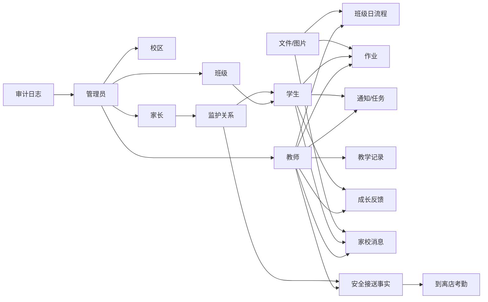

# 锐之博托管中心系统项目审查与下一阶段路线图

审查日期：2026-08-18
审查范围：当前工作区 `main` 分支的真实实现状态、最近 30 次提交、后端 Prisma/NestJS、管理后台、教师端小程序、家长端小程序、部署与验证脚本、现有文档。
审查方式：初始路线图来自只读审查；后续条目同步记录每个获授权 CP 的实际代码、迁移和隔离环境验证状态。

CP-32 后续更新（2026-08-17）：workflow 图片安全与发布门禁的代码部分已完成；真实 HTTPS、微信公众平台合法域名和体验版真机验收仍为 `WAITING_FOR_EXTERNAL_ACCEPTANCE`。当时尚未进入 CP-33；后续授权见下一条更新。

CP-33 后续更新（2026-08-17）：用户已单独授权执行最新重新定义的 **CP-33 安全接送与到离店闭环**。代码、数据库 migration、三端页面和专属回归已完成；验收反馈中的请假跨端一致性、家长首页经办教师、具体送达人、教师异常标签、后台班级/占位时间、重复点击和放学高峰批量操作也已回补。微信真机与真实门店交接验收仍为 `WAITING_FOR_EXTERNAL_ACCEPTANCE`。历史同编号“发布流水线与回滚演练”已被替代；该轮当时未进入 CP-34，后续授权见 CP-34 更新。

CP-33.1 后续更新（2026-08-17）：安全审查发现 CP-33 将历史监护关系默认扩权为 `canPickup=true`，且缺勤与已开始接送链可能形成冲突事实。代码修复已将监护人接送权改为显式授权，并通过新 migration 收紧历史自动授权；缺勤/接送增加服务事务检查及数据库 trigger/advisory lock 双向互斥。历史冲突责任数据不会自动删除，后台默认值和真机接送人刷新仍待人工确认。该轮当时未进入 CP-34，后续已获单独授权。

CP-34 后续更新（2026-08-17）：用户已单独授权 **CP-34 学生级一日托管流程**。代码在保留班级 Workflow 体系的基础上新增 `StudentWorkflowStep`，完成单人/批量处理、缺勤动态合成、家长今日进度、管理端只读查询、GrowthRecord 停写与 24 场景专属回归；代码和本地/隔离环境自动验证已完成，真机高频操作与个人图片体验仍为 `WAITING_FOR_EXTERNAL_ACCEPTANCE`。该轮当时未进入 CP-35，后续授权见下一条更新。

CP-35 后续更新（2026-08-18）：用户已单独授权 **CP-35 生活照护与异常记录**。工作区已新增统一 `StudentCareRecord`、五类受控生活事实、班级批量操作、`scene=care` 图片策略、家长今日生活摘要、管理端只读异常筛选及 30 场景专属回归；代码和本地/隔离环境自动验证已完成，20 人班高频操作、真机图片与三端异常展示仍为 `WAITING_FOR_EXTERNAL_ACCEPTANCE`。本轮不进入 CP-36。

## 1. 执行摘要

当前项目已经从“原型”进入“可封闭验证的内测系统”阶段。后端、管理后台、教师端、家长端四端已经围绕基础资料、教师/家长登录、通知回执、作业提交批阅、成长记录、教案教研、消息图片、文件存储、审计日志、部署检查和回归脚本形成了较完整的闭环。

但它还不应被判断为“真实门店可长期运营系统”。安全接送、学生级日流程和生活照护的代码责任链已经补齐，但仍需微信真机、真实门店交接与高频操作验收；每日托管报告、续费/收费与经营指标仍不完整。当前系统已能分别保存每个孩子的流程状态与用餐、饮水、休息、情绪和异常事实。

总体判断：

| 维度 | 当前成熟度 | 判断 |
| --- | ---: | --- |
| 工程基础 | 78% | 架构清晰，脚本和部署意识较好，但缺 CI、真实端验收和部分安全加固 |
| 后端业务闭环 | 86% | 安全接送、学生级流程和生活照护事实链可用；缺每日聚合报告 |
| 管理后台 | 83% | 基础管理、接送追溯、学生流程与生活照护只读查询可用；缺经营看板与招生收费 |
| 教师端 | 85% | 今日接送、学生流程及生活照护批量/例外操作已成形；仍待真机高频验收 |
| 家长端 | 80% | 今日接送、托管进度、今日生活、作业、成长、通知、消息可用；缺每日可读报告 |
| 部署/验收 | 74% | Docker、Caddy、备份、发布验证脚本已具备；真实 HTTPS/微信体验版仍待验收 |
| 业务可上线性 | 64% | 接送代码责任链已具备，真实微信和门店规程验收前仍只适合小范围内测 |

当前不自动选择下一开发 CP。应先完成 CP-32 的真实 HTTPS/微信体验版验收、CP-33 的真机和门店接送责任链验收、CP-34 的真机学生流程验收，以及 CP-35 的生活照护 20 人班/异常跨端验收；不得自动进入 CP-36。

## 2. 当前代码与分支状态

当前分支状态：

- 当前分支：`main`
- 远程基线：`22aca81 feat: add student-level daily workflow tracking`
- 当前 CP-35 修改尚未提交
- 最近开发节奏：从基础端到端流程、通知/作业/消息，再到管理后台、数据安全、部署验证、备份恢复、观测、正式管理员登录、发布验证门禁和回归验收，提交历史连续且方向清晰。

最近关键提交说明：

| 提交 | 内容 |
| --- | --- |
| `146e128` | 增加管理后台回归脚本与验收报告 |
| `ac40fbc` | 增加发布验证门禁 |
| `5195471` | 增加正式管理员认证 |
| `cad7bf5` | 增加结构化 API 观测能力 |
| `759055f` | 增加部署备份与恢复 |
| `5aa48d5` | 增加聊天图片消息 |
| `c408177` | 增加生产文件存储 |
| `581c822` | 增加 API 验证与测试部署 |
| `5e1d54e` | 完成微信认证流程 |

结论：项目历史呈现出“逐步闭环、逐步加固”的良好趋势。当前最需要的是把已经做好的技术闭环拿到真实微信/真实域名环境中验收，并补齐托管行业的安全核心链路。

## 3. 当前真实能力清单

### 3.1 后端能力

后端采用 NestJS + Prisma + PostgreSQL，主要模块包括：

- `auth`：开发登录、正式管理员登录、微信登录、手机号绑定、当前用户信息。
- `admin`：教师、家长、班级、学生、监护关系、流程模板、业务数据、审计日志管理。
- `teacher`：教师工作台、班级学生、日流程、教学记录、成长反馈、教案、教研、作业、通知、会话消息。
- `parent`：孩子列表、成长时间线、考勤、作业提交、通知查看/确认、会话消息。
- `pickup`：学校接到、安全到店、正常/临时/异常离店、授权接送人、家长查询和管理端追溯。
- `files`：本地/S3 文件存储、文件元数据、图片消息和作业附件基础能力。
- `audit`：结构化审计日志。
- `health`：健康检查。

已经完成的关键闭环：

- 管理员正式登录和权限保护。
- 教师/家长微信登录与手机号绑定基础流程。
- 基础数据 CRUD：教师、家长、班级、学生、监护关系、流程模板。
- 教师发布通知，家长确认回执，教师查看回执。
- 教师布置作业，家长提交，教师批阅。
- 教师创建成长反馈，家长查看成长时间线。
- 教师/家长一对一学生维度消息会话。
- 图片消息、文件资产、存储驱动抽象。
- 管理端业务查询与状态操作。
- 教师登记接送事实，家长查看今日/历史，管理员维护授权人与筛选异常；到离店同步兼容考勤。
- 审计日志、请求 ID、结构化日志、部署验证、备份恢复。

### 3.2 管理后台能力

管理后台采用 Vite + React + Ant Design，当前包含：

- 登录页，支持正式管理员登录；开发登录只在开发环境显示。
- 总览工作台。
- 教师管理。
- 家长管理。
- 班级管理。
- 学生管理。
- 业务管理：作业、教学记录、成长记录、考勤、流程、教案、教研、接送记录与异常筛选。
- 学生家长接送权限和非账号型授权接送人管理。
- 流程模板管理。
- 审计日志查询。

管理后台已经具备“内测运营后台”的雏形。主要不足在于：

- 没有经营指标看板，例如今日到店、未离店、欠费/续费、班级容量、教师负载。
- 没有招生、报名、套餐、订单、收费、续费模型。
- 一般业务仍有强删除能力；关联安全接送责任记录的教师、家长、班级和学生已禁止强制删除。
- 管理后台仍以数据维护为主，还不是店长每日运营驾驶舱。

### 3.3 教师端小程序能力

教师端采用 Taro，当前页面包括：

- 首页工作台。
- 登录。
- 备课。
- 教研。
- 教学。
- 日流程。
- 今日接送。
- 通知。
- 消息列表与聊天。

教师端已经能支撑：

- 查看班级和学生。
- 进行班级级日流程打卡。
- 创建教学记录和成长反馈。
- 管理教案。
- 创建和参与教研活动。
- 发布作业和处理提交。
- 发布通知并查看回执。
- 与家长沟通，支持图片消息。
- 按学生快速登记学校接到、安全到店、直接到店和严格离店确认。

关键不足：

- 没有生活记录，例如饮水、用餐、午休、情绪、异常。
- 学生级流程虽已支持批量正常处理和单人例外，但尚未完成真机 20 人高频操作验收。

### 3.4 家长端小程序能力

家长端采用 Taro，当前页面包括：

- 首页。
- 登录。
- 作业。
- 成长。
- 消息。
- 聊天。
- 我的/资料。
- 接送记录。

家长端已经能支撑：

- 查看绑定孩子。
- 查看成长记录和考勤摘要。
- 查看并提交作业。
- 查看并确认通知。
- 与教师消息沟通，支持图片消息。
- 查看孩子今日接送状态、经办教师、接送人和历史时间线。

关键不足：

- 家长不能看到一个聚合的“今日托管报告”。
- 成长/作业/通知/消息已经分散可用，但还没有形成对家长最有价值的一屏摘要。

## 4. 业务链路审查

当前核心业务链路可以表达为：



### 已经串起来的链路

| 链路 | 当前状态 | 说明 |
| --- | --- | --- |
| 管理员建基础资料 | 已完成 | 教师、家长、班级、学生、监护关系均可管理 |
| 教师登录/家长登录 | 基本完成 | 开发登录可验证，微信登录/绑定已实现，真实微信仍需体验版验收 |
| 通知确认 | 已完成 | 教师发通知，家长查看并确认，教师看回执 |
| 作业提交批阅 | 已完成 | 教师布置，家长提交，教师批阅并生成成长记录 |
| 成长反馈 | 已完成 | 教师创建，家长查看 |
| 消息沟通 | 已完成 | 学生维度会话，支持图片，文件归属校验较完善 |
| 教案教研 | 已完成 MVP | 教师创建、更新、状态流转，管理端可查询 |
| 审计与部署检查 | 已完成 MVP | 审计日志、发布验证、备份恢复已具备 |
| 安全接送 | 代码已完成，待外部验收 | 学校接到、到店、授权/临时/异常离店、家长查看与管理端追溯已闭环 |
| 学生级托管流程 | 代码已完成，待外部验收 | 每名学生独立状态、批量正常处理、家长进度与管理端只读查询已闭环 |
| 生活照护与异常 | 代码已完成，待外部验收 | 用餐、饮水、休息、情绪、异常、班级批量、家长摘要与后台筛选已闭环 |

### 仍未形成真实闭环的链路

| 链路 | 当前状态 | 风险 |
| --- | --- | --- |
| 每日托管报告 | 缺失 | 家长价值感不足，需要分散查看多处信息 |
| 招生/报名/套餐/收费/续费 | 缺失 | 无法支撑商业运营闭环 |
| 经营指标看板 | 很弱 | 管理者无法快速掌握今日运营状态 |

结论：当前项目已经具备“教务沟通型系统”的基础，但还没有完全进入“托管运营型系统”。下一阶段的重点应从资料维护转向“每天真实托管的一天”。

## 5. 数据库模型审查

### 5.1 已有核心模型

当前 Prisma schema 覆盖了以下对象：

- 用户与角色：`User`、`UserRole`、`UserStatus`
- 组织与班级：`Campus`、`Class`
- 学生与家长：`Student`、`StudentGuardian`
- 考勤：`AttendanceEvent`
- 安全接送：`AuthorizedPickupPerson`、`PickupRecord`、接送事件/到店方式/交接状态枚举
- 流程：`WorkflowTemplate`、`WorkflowTemplateStep`、`WorkflowSession`、`WorkflowStep`、`StudentWorkflowStep`
- 生活照护：`StudentCareRecord`、照护类型/餐次/异常类别枚举
- 作业：`HomeworkAssignment`、`HomeworkSubmission`
- 教学与成长：`TeachingRecord`、`GrowthRecord`
- 教案与教研：`LessonPlan`、`ResearchActivity`、`ResearchParticipant`
- 消息：`Conversation`、`Message`
- 通知：`Notice`、`NoticeReceipt`
- 文件：`FileAsset`
- 审计：`AuditLog`

### 5.2 模型优点

- 角色、用户、学生、班级、监护关系的边界清晰。
- `StudentGuardian` 已包含接收通知、提交作业、查看成长等权限位，适合后续扩展监护人能力差异。
- `StudentGuardian.canPickup` 复用账号型家长，`AuthorizedPickupPerson` 只承载非账号型接送人，避免重复父母资料。
- `PickupRecord` 使用事实事件、接送人快照、审计、唯一约束和中国业务日，适合责任追溯。
- `StudentWorkflowStep` 在班级步骤下保存学生独立终态，缺勤由考勤动态合成；唯一约束、事务和条件更新阻止重复处理。
- `HomeworkSubmission` 对作业和学生做唯一约束，避免重复提交。
- `Conversation` 按学生、家长、教师唯一，契合真实家校沟通。
- `FileAsset` 抽象了存储驱动与文件归属，为本地/S3 切换打好了基础。
- `AuditLog` 记录操作者、动作、实体和详情，适合管理端追溯。

### 5.3 模型风险与缺口

| 等级 | 问题 | 影响 |
| --- | --- | --- |
| 已解决 | 班级级 Workflow 无法表达学生差异 | CP-34 在保留班级结构下新增 `StudentWorkflowStep`，支持独立状态、时间、备注和照片 |
| 已解决 | 安全接送模型缺失 | CP-33 新增接送事实与授权模型，并事务同步 `AttendanceEvent` |
| 已解决 | 缺少生活记录模型 | CP-35 新增统一 `StudentCareRecord`，结构化保存五类生活事实并保护历史引用 |
| P1 | 接送历史尚无更正/冲正机制 | 当前禁止修改删除；真实纠错需要保留原值、原因和更正人 |
| P1 | 缺少招生/报名/套餐/收费/续费模型 | 无法支撑商业运营 |
| P1 | `StudentGuardian.status` 和 `WorkflowSession.status` 使用 `String` | 状态值缺少类型约束，长期容易出现脏数据 |
| P2 | 部分高频列表字段索引不足 | 数据量扩大后可能影响查询性能 |
| P2 | 删除策略依赖服务层强删除逻辑 | 需要更明确的数据保留和恢复策略 |

### 5.4 数据关系建议

下一阶段不建议大拆现有模型，而应增量补齐：

- 学生级流程已由 CP-34 以 `StudentWorkflowStep` 增量补齐，不新增平行 session；后续如需更正只增加显式冲正，不覆盖终态。
- 接送模型已由 CP-33 增量补齐；后续如需纠错，只增加显式冲正，不覆盖原始事实。
- 生活记录已由 CP-35 以统一 `StudentCareRecord` 增量补齐；后续日报只聚合该事实，不反向修改原记录。
- 新增每日报告聚合模型，例如 `DailyReport`，由考勤、学生级流程、作业、成长和生活记录生成。
- 后续再新增 `Lead`、`Enrollment`、`ServicePackage`、`Order`、`PaymentRecord`、`RenewalReminder` 等经营模型。

## 6. API 与权限审查

### 6.1 权限边界

当前权限基本结构良好：

- `AuthGuard` 会校验 JWT、用户状态和 token role。
- `RolesGuard` 用于 admin/teacher/parent 角色隔离。
- 管理端接口统一限制为 admin。
- 教师端接口限制为 teacher，并通过班级归属校验学生、作业、通知、会话。
- 家长端接口限制为 parent，并通过 active `StudentGuardian` 关系校验孩子访问权。

家长侧权限设计值得肯定：

- 成长和考勤依赖 `canViewGrowth`。
- 作业提交依赖 `canSubmitHomework`。
- 通知接收依赖 `canReceiveNotice`。
- 会话也会检查活跃监护关系。

### 6.2 安全问题

| 等级 | 问题 | 证据 | 建议 |
| --- | --- | --- | --- |
| 已修复 | 教师 workflow 打卡图片归属和 scene 校验 | CP-32 已让 message、homework、workflow 复用同一 FileAsset 策略 | ownerId=当前教师、scene=workflow、文件存在且为图片，否则返回 400 |
| P0 | 真实微信/HTTPS/合法域名尚未完成最终体验版验收 | 文档显示仍待真实环境验收 | 下一 CP 必须以真实手机和微信开发者工具完成 |
| 已加固 | 接送责任链可能被主数据强删除破坏 | CP-33 将接送引用纳入引用统计，并拒绝强制删除关联教师、家长、班级、学生 | 历史事实保留；账号/学生改为停用或结业 |
| P1 | Dev login 依赖环境配置禁用 | 生产 compose 与 `deploy/.env.example` 均默认禁用，本地 API 示例仅供封闭开发启用 | 发布门禁继续强制检查，真实环境必须确认 `ENABLE_DEV_LOGIN=false` |
| P1 | 缺少刷新 token / session 管理 | 当前以 Bearer token 为主 | 内测可接受，生产后要增加失效、登出、设备维度控制 |
| P2 | 错误码语义仍偏基础 | 统一 filter 已有，但业务错误码体系较弱 | 后续按业务域补充稳定错误码 |

### 6.3 API 覆盖判断

| 业务域 | 覆盖程度 | 说明 |
| --- | --- | --- |
| 基础资料 | 高 | admin CRUD 已覆盖 |
| 登录认证 | 中高 | dev/admin/wechat/bind 已有，真实微信验收待完成 |
| 通知任务 | 高 | 发布、查看、确认、回执已覆盖 |
| 作业 | 高 | 发布、提交、批阅已覆盖 |
| 消息 | 高 | 会话、文本、图片已覆盖 |
| 成长记录 | 中高 | 教师反馈与作业批阅记录可见 |
| 日流程 | 中 | 班级级可用，学生级不足 |
| 考勤接送 | 中高 | CP-33 代码闭环完成并兼容 `AttendanceEvent`，待真机与门店责任流程验收 |
| 生活记录 | 无 | 暂未实现 |
| 招生收费 | 无 | 暂未实现 |
| 经营看板 | 低 | 有基础统计，没有业务经营指标 |

## 7. 前端与体验审查

### 7.1 管理后台

优点：

- 页面结构清晰，覆盖基础资料与业务查询。
- 正式管理员登录已取代纯开发登录。
- 业务查询已经覆盖作业、教学、成长、考勤、流程、教案、教研和安全接送。
- 审计日志页面补齐了运营追溯入口。

不足：

- 对真实店长来说，首页还应优先展示今日到店、未离店、待确认通知、待批阅作业、异常学生、即将续费等。
- 安全接送责任记录已阻止关联主数据强删；其他业务强删仍需持续收紧。
- 业务管理偏“数据列表”，还缺“今日运营动作”。

### 7.2 教师端

优点：

- 教师日常模块已经比较完整：工作台、备课、教研、教学、流程、通知、消息。
- 适合小规模内测老师试用。

不足：

- 今日接送已提供学生级状态与大按钮，但完整工作台统计仍偏轻。
- 班级级 workflow 让老师操作简单，但牺牲了学生级真实性。
- 到离店和异常接送代码已补齐，生活记录仍会在真实托管场景中形成缺口。

### 7.3 家长端

优点：

- 家长能看到孩子、作业、成长、通知和消息。
- 通知确认和作业提交是有效闭环。

不足：

- 家长最关心的“今天孩子怎么样”还没有聚合表达。
- 当前信息分散在多个页面，需要用户主动寻找。
- 安全接送状态已进入首页和历史页，仍需真机与真实交接场景确认信任表达是否足够清晰。

### 7.4 前端工程问题

| 等级 | 问题 | 影响 |
| --- | --- | --- |
| P1 | Taro 小程序中存在大量 `// @ts-nocheck` | `typecheck` 对小程序真实问题拦截能力不足 |
| P1 | 家长成长页存在月份格式风险 | `date.getMonth()` 是零基月份，可能显示错误月份 |
| P2 | 管理端部分业务查询使用宽泛 `any` | 中长期维护风险增加 |
| P2 | 日期格式和状态显示分散 | 后续多端一致性成本上升 |

## 8. 验证与部署审查

### 8.1 已有验证资产

当前项目已有较好的脚本化验证意识：

- `tools/verify-test-deployment.ps1`
- `tools/run-regression.mjs`
- `tools/backup-test-deployment.ps1`
- `tools/restore-test-deployment.ps1`
- API 侧 `verify:admin`、`verify:admin-auth`、`verify:teacher`、`verify:parent`、`verify:pickup`、`verify:storage`、`verify:storage-drivers`、`verify:message-images`、`verify:observability`、`verify:all`
- 发布验证文档和回归验收文档

已有验证覆盖：

- 健康检查和数据库连接。
- 生产环境 dev login 禁用。
- CORS。
- 管理员正式登录。
- 管理后台静态页面。
- 文件上传。
- 本地/S3 存储驱动。
- 消息图片归属。
- 基础权限负向用例。
- 管理端 CRUD 与业务查询。
- 审计日志。
- 备份恢复。
- CP-33 接送 14 个规定场景、管理员快捷筛选与历史不可删除保护。
- CP-34 学生流程 24 个场景与 CP-35 生活照护 30 个场景，均已接入 `verify:all`。

### 8.2 验证缺口

| 等级 | 缺口 | 建议 |
| --- | --- | --- |
| P0 | 真实微信登录和手机号绑定体验版验收 | 使用微信开发者工具 + 真机 + 体验版完成 |
| P0 | CP-33 真实接送责任链尚未真机/门店验收 | 用两个微信账号和真实老师按学校接到、到店、授权/异常离店验收 |
| 已完成 | workflow 图片归属/scene 自动回归 | `verify:workflow-image-policy`、`verify:workflow-images` 已加入，并接入 `verify:all` / release gate |
| P0 | CP-34 学生级流程尚未真机高频验收 | 用真实微信与脱敏 20 人班验证批量正常处理、例外处理、家长隔离和个人图片 |
| P0 | CP-35 生活照护尚未真机高频和异常跨端验收 | 用 20 人班验证批量例外保护，并确认教师、家长、管理端的异常与图片一致 |
| P1 | 没有 CI/CD 门禁 | 至少增加 typecheck/build/verify 脚本的流水线 |
| P1 | 小程序端类型检查有效性不足 | 移除关键路径 `ts-nocheck` 后再纳入门禁 |
| P1 | 强删除和恢复流程缺少真实演练记录 | 每次试运营前做一次备份恢复演练 |
| P2 | 缺少 API 契约文档自动生成 | 可后续增加 OpenAPI 或脚本生成文档 |

### 8.3 部署状态

当前部署资产包括：

- API Dockerfile。
- Admin Web Dockerfile。
- PostgreSQL + API + Caddy 测试 compose。
- 本地/S3 存储 compose。
- Caddy 反向代理和安全响应头。
- 部署环境变量样例。
- 备份恢复脚本。

部署风险：

- 真实生产需要 HTTPS 域名、微信小程序合法域名、稳定对象存储、数据库备份策略。
- `.env` 中微信、JWT、数据库密码、S3 凭据需要明确密钥管理方式。
- 儿童图片属于敏感数据，应尽早明确访问控制、保留周期和删除策略。
- 当前没有看到 CI/CD 配置，发布依赖人工执行脚本。

## 9. 文档一致性审查

整体上，文档已经跟上了大部分最新开发进度。README、development、deployment、storage、backup、observability、admin auth、release verification、regression acceptance 等文档能反映当前主线。

发现的轻微漂移：

| 文档 | 漂移点 | 建议 |
| --- | --- | --- |
| `docs/regression-acceptance-2026-08-14.md` | 验收版本为 `ac40fbc`，当前 HEAD 为 `146e128` | 标注该报告是 `ac40fbc` 的验收证据，下一次发布重新生成 |
| `docs/release-verification.md` | CP-32 已纳入 workflow 图片归属校验与生产配置审计 | 已同步，无待处理漂移 |
| `docs/api.md` | 消息枚举包含 file/system，但当前消息输入实际只开放 text/image | 明确“当前开放类型”为 text/image |
| `docs/database.md` | 已补 CP-33 接送、CP-34 学生流程及 CP-35 生活照护模型/状态语义 | 已同步 |
| `docs/development.md` | 小程序 `ts-nocheck` 与类型检查限制需说明 | 防止开发者误判 typecheck 覆盖度 |

结论：CP-35 文档已同步。主要风险转为真实微信/门店验收、学生流程与生活照护高频真机验收，以及接送/流程历史纠错机制；本轮不进入 CP-36。

## 10. 风险清单

### P0：上线前必须处理

1. 真实微信登录、手机号绑定、合法域名和 HTTPS 体验版验收尚未完成。
2. 学生级 workflow 代码已完成，但未经真机高频操作和真实班级试运行前不能作为唯一托管事实依据。
3. 安全接送结构化代码已完成，但未经真实门店流程验收前不能作为唯一离店责任依据。
4. 生活照护代码已完成，但未经 20 人班高频操作、真机图片和异常三端展示验收前不能替代门店现行生活记录。

已解决的原 P0：教师 workflow 打卡图片 FileAsset 归属和 scene 校验已在 CP-32 完成代码修复与自动回归。

### P1：内测期间优先处理

1. 接送历史缺少显式更正/冲正流程；当前以不可改、不可删保护原始事实。
2. 家长端缺少每日托管报告。
3. 生活记录缺失。
4. 非接送领域的管理后台强删除能力仍需持续收紧。
5. 小程序大量 `ts-nocheck` 降低类型门禁价值。
6. 缺少 CI/CD 自动门禁。

### P2：中期优化

1. 业务状态字段统一 enum。
2. 高频查询索引优化。
3. API 契约文档自动化。
4. 多端状态文案和日期格式统一。
5. 管理后台细节体验优化。

## 11. 是否适合 20-50 学生、2-5 教师小规模内测

可以小范围内测，但内测边界需要明确。

适合验证：

- 家长登录绑定。
- 教师登录。
- 通知确认。
- 作业发布、提交、批阅。
- 成长反馈。
- 家校消息。
- 图片上传。
- 管理后台资料维护。
- 管理端业务查询。
- 安全接送模拟数据与权限/重复/异常自动验证。

不适合在外部验收完成前直接作为唯一正式生产责任链路：

- 安全接送（代码已完成，等待真实微信与门店交接验收）。
- 学生级日流程。
- 生活照护记录。
- 每日报告。
- 收费续费。
- 店长经营看板。

建议内测话术：当前系统适合验证“教务协作和家校沟通”，暂不把它作为唯一的“托管安全接送与收费台账”系统。

## 12. 下一阶段路线图

### 阶段 A：真实环境验收与安全底座

目标：让现有系统能在真实微信和真实测试域名下被安全地体验。

#### CP-32 真实上线验收与儿童数据安全加固

目标：

- 完成真实 HTTPS 域名、微信开发者工具、真机、体验版链路验收。
- 修复 workflow 图片归属与 scene 校验。
- 强化生产发布前检查，确保 dev login、CORS、管理员密码、存储、备份均可验证。

后端变更：

- workflow 打卡时校验 `photoUrls` 对应 `FileAsset`。
- 要求文件 ownerId 为当前教师，scene 为 `workflow`。
- 增加对应负向用例。

教师端变更：

- 确保 workflow 图片上传使用 `scene=workflow`。
- 图片上传失败时给出明确反馈。

家长端变更：

- 无强制变更。

管理后台变更：

- 无强制变更，可在审计中确认 workflow 打卡记录。

文档与脚本：

- 更新发布验证文档。
- 更新回归脚本，加入 workflow 图片归属负向测试。
- 记录真实微信体验版验收结果。

验收标准：

- 真实域名 HTTPS 可访问管理后台和 API。
- 微信开发者工具能成功打开教师端/家长端。
- 真机体验版能完成微信登录或绑定流程。
- 生产环境 dev login 被拒绝。
- workflow 不能引用他人上传的图片或错误 scene 图片。
- 发布验证脚本通过。

风险：

- 微信开放能力依赖小程序配置和账号资质，可能需要人工配合。

实现状态（2026-08-17）：

**代码已完成**

- workflow 保存前统一校验 FileAsset 存在、ownerId、scene=`workflow` 和图片 MIME；非法引用返回 400。
- 消息、作业与 workflow 共用 `file-asset-policy.ts`，没有新增互相分叉的权限体系。
- 教师端上传继续明确传递 `scene=workflow`，上传错误会明确显示且保留待重试照片。
- 新增策略级五用例回归和完整 HTTP 回归，覆盖合法图片、message scene、homework scene、跨教师和不存在资产。
- `verify:all` 包含 workflow HTTP 回归；`verify:release` 在远程检查前强制执行 workflow 策略门禁和生产配置审计。
- 已自动验证 admin regression、teacher、parent、message images、storage、observability；未修改数据库 schema 或新增业务 API。

**WAITING_FOR_EXTERNAL_ACCEPTANCE**

- 真实 HTTPS 域名和可信证书访问管理后台/API。
- 微信公众平台为教师端、家长端分别配置 request、uploadFile、downloadFile 合法域名。
- 将教师端/家长端 AppID、AppSecret 写入实际部署环境（不得提交 Git），并完成体验版登录/绑定。
- 教师端与家长端真机完成登录、数据隔离、workflow 合法图片上传和查看。
- 在隔离环境完成一次实际备份恢复演练；正式数据库只做备份与非写入校验。

当前整体状态：`WAITING_FOR_EXTERNAL_ACCEPTANCE`。代码部分完成不因上述外部条件而回退为未完成。用户随后已单独授权最新路线重新定义的 CP-33；这不代表 CP-32 外部项已完成。

#### CP-33 安全接送与到离店闭环

编号说明：这是 2026-08-17 最新路线重新定义的业务 CP-33，替代历史同编号“发布流水线与回滚演练”。旧提案不再是 CP-33 的任务来源，CI/CD 也不在本轮范围。

实现状态：**代码已完成；真实微信与门店交接为 `WAITING_FOR_EXTERNAL_ACCEPTANCE`；该轮完成后曾停止，CP-34 后续另行授权。**

数据与后端：

- `StudentGuardian` 增加 `canPickup`，账号型父母继续复用监护关系。
- 新增 `AuthorizedPickupPerson` 保存非账号型固定授权人；新增 `PickupRecord` 保存学校接到、到店、离店事实。
- 离店记录保存接送人姓名、关系、电话快照，并记录经办教师、操作者、发生时间、到店方式、交接状态、异常原因、处理结果和备注。
- 正常离店只接受 active 且有权限的监护人或有效授权人；临时/异常交接强制填写身份和处理结果，异常还必须填写原因。
- 按 UTC+8 中国业务日查询；服务校验、数据库唯一约束和事务阻止重复到店/离店。
- 到店/离店与 `AttendanceEvent.arrive` / `leave` 在同一事务内同步，保持既有家长和管理端考勤兼容。
- 当日 `AttendanceEvent.absence` 统一驱动教师和家长请假状态，并从后台“今日未到店”排除；已有接送事实优先，避免中途责任链被请假标记截断。
- 家长送达到店可选择具体 active 监护人/授权人，保存送达人关联和快照，跨学生引用被后端拒绝。
- 不提供接送事实更新/删除 API；接送引用会阻止教师、家长、班级和学生强制删除。

界面：

- 教师端新增“今日接送”与工作台入口，按班级/状态快速登记学校接到、直接到店、安全到店和严格离店；支持状态分组、整组多选与批量学校接到/安全到店。
- 教师端临时授权/异常离店使用明确文字标签，确认离店的同步请求锁会在第二个网络请求发出前阻断连点。
- 家长首页展示今日状态并提供历史时间线，展示经办教师、送达人/接送人快照及明显异常提示。
- 管理后台维护接送权限和非账号型授权人，并按日期、学生、班级、教师、事件、状态、异常查询；提供今日未到店、今日未离店、异常接送快捷筛选，正确读取根层班级，空缺占位不伪造 08:00 事件时间。

自动验证：

- 新增 `verify:pickup`，覆盖规定的 14 个正常、权限、重复、异常和考勤兼容场景。
- 额外验证请假三端一致、具体送达人和跨学生拒绝、批量原子写入/重复拒绝、管理员班级与空事件时间、快捷筛选以及历史接送事实阻止主数据强删。
- `verify:pickup` 已接入 `verify:all`；测试事实不可删除，脚本结束只停用隔离主体，不得在生产数据库运行。

明确不做：

- 接送照片、完整历史纠错/冲正、学生级完整 workflow、生活记录、日报/周报、收费经营、订阅消息、AI、CI/CD、SaaS、多租户。

**WAITING_FOR_EXTERNAL_ACCEPTANCE**

- 教师端和家长端在微信开发者工具及真机验证大按钮操作、状态刷新、重复点击、异常必填和失败反馈。
- 使用两个真实微信账号验证教师跨班、家长跨家庭和停用授权人保护。
- 由真实老师按学校接到、家长送达、固定授权人接走、临时/异常接走场景核对门店责任记录和管理端追溯。
- 用 10 名真实/脱敏测试学生执行一次批量学校接到、批量安全到店和逐人离店的高峰试运行。

#### CP-33.1 安全接送审查修复

实现状态：**代码已完成；管理后台与真机授权展示为 `WAITING_FOR_EXTERNAL_ACCEPTANCE`；CP-34 后续另行授权。**

- `StudentGuardian.canPickup` 默认改为 `false`，后台新建绑定默认关闭，后端在字段缺失时也不会授权。
- 新 migration 不改动已发布的 CP-33 migration，统一撤销缺少明确证据的历史自动授权；管理员需要重新逐位确认。
- 缺勤与接送事实双向互斥，单个/批量 API 在事务内复查；数据库 trigger 使用相同业务日 advisory lock 处理直接写入和并发。
- 自动回归覆盖未授权拒绝、明确授权成功、absence → pickup、pickup → absence、遗留冲突继续到店拒绝和批量原子失败。
- 不删除任何历史 `PickupRecord` 或冲突 `AttendanceEvent`；完整历史纠错/冲正仍是后续独立提案。

### 阶段 B：托管核心业务闭环

目标：把系统从“教务沟通”推进到“托管运营”。

#### CP-34 学生级一日托管流程

实现状态：**代码已完成；真机与真实高频操作为 `WAITING_FOR_EXTERNAL_ACCEPTANCE`；CP-35 后续已获单独授权。**

已完成：

- 保留 `WorkflowTemplate`、`WorkflowTemplateStep`、`WorkflowSession`、`WorkflowStep`；新增 `StudentWorkflowStep`，不创建平行的学生 session。
- 支持每名学生独立 `pending/completed/skipped/exception`，缺勤由当天 `AttendanceEvent.absence` 动态合成为 `absent`，缺勤学生禁止执行流程。
- 学生记录在当天 session 首次加载时按 active 学生幂等补齐；历史已完成且尚无学生事实的当天步骤首次补齐为 completed，旧 migration 和旧历史不删除。
- `WorkflowStep.checked` 表示所有 active、非缺勤学生均已处理；完成、跳过、异常均离开 pending，Dashboard 未完成步骤统计保持兼容。
- 新增单学生完成、跳过、异常与可选 `studentIds` 的批量完成 API；旧 `/check` 保持全班批量兼容。批量事务化，非法列表整批失败，已处理状态不被覆盖。
- 单人操作只允许 pending 进入终态；跳过/异常原因必填，重复操作和终态改写返回 `409`；教师跨班、step/session 不匹配和学生越权均被拒绝。
- 班级照片与个人照片分别保存在 `WorkflowStep.photoUrls` / `StudentWorkflowStep.photoUrls`，都复用当前教师 owner、`scene=workflow`、图片类型和文件存在验证。
- 教师端以步骤为中心提供汇总、快捷筛选、批量完成、学生轻量详情、接送上下文与今日时间线；家长首页展示自己的今日托管进度、备注和个人照片。
- 管理端新增日期、班级、教师、学生、状态筛选及完整步骤详情，仅查询，不提供修改/删除历史事实。
- 普通 workflow 操作不再批量创建 `GrowthRecord`，旧记录保留；后续日报可以直接聚合学生流程事实。
- 新增 migration `20260817210000_add_student_workflow_steps` 和 `verify:student-workflow`；24 个规定场景通过，并已接入 `verify:all`。

`WAITING_FOR_EXTERNAL_ACCEPTANCE`：

- 真机准备 completed、skipped、exception、absent 各一人，确认步骤 checked、教师视图、家长隔离和个人图片链路。
- 20 名脱敏学生执行“批量完成 17 人 + 1 跳过 + 1 异常 + 1 缺勤”，确认滚动、反馈和耗时适合放学高峰。
- 管理后台人工确认筛选、完整步骤和只读边界。

#### 历史 CP-35 安全接送提案（已被替代）

该历史提案已由最新重新定义的 **CP-33 安全接送与到离店闭环** 替代。当前实际实现和验收状态以本节上方 CP-33 为准，不再按 CP-35 重复开发。历史提案曾提到“导出接送记录”，但最新 CP-33 只要求查询和追溯，因此导出未实现，也不得表述为已完成。

#### CP-35 生活照护与异常记录（最新授权）

> 编号说明：本 CP-35 是 2026-08-18 最新业务路线定义。上方“历史 CP-35 安全接送提案”已经被 CP-33 替代；此前暂列为 CP-36 的生活照护草案由本次授权正式调整为 CP-35。

实现状态：**代码已完成；20 人班、真机图片与异常跨端展示为 `WAITING_FOR_EXTERNAL_ACCEPTANCE`；完成后停止，不进入 CP-36。**

已完成：

- 新增统一 `StudentCareRecord`，以 `meal/water/rest/mood/exception` 五种类型及受控字段保存生活事实，不使用万能 JSON，也不扩展成医疗系统。
- 用餐按 `snack/dinner` 餐次记录 `good/normal/little/refused`；主要休息每天一条，饮水和情绪允许多条，异常只追加。PostgreSQL partial unique index 保护用餐与休息唯一性。
- 教师只能操作自己负责班级的 active 学生；当天缺勤全部拒绝。所有照护类型（含异常）均以 `happenedAt` 校验离店边界，离店后可补录发生于离店前的历史事实。全部时间继续使用 Asia/Shanghai 业务日工具。
- 单学生按类型拆分 DTO；批量用餐、饮水、休息必须显式传学生列表，在同一事务中预检并全部提交。批量用餐/休息只补齐缺失项，不覆盖已有例外。
- 新增 `scene=care`，照片保存前统一验证当前教师 owner、scene、图片 MIME 和文件存在；家长响应只返回安全 URL，不泄露 FileAsset 元数据。
- 教师端新增按班级组织的“今日照护”和单学生操作；家长首页新增“今日生活”并突出需要关注的全部异常；管理后台新增默认今日、最长 31 天、数据库分页的只读查询与快捷筛选。
- 异常要求原始事实备注，可保存简单类别、非医疗处理和 `needsAttention`；不提供诊断、用药、覆盖或删除能力。
- CareRecord 不自动生成 `GrowthRecord`，也不复制或修改 Pickup/Workflow；未来每日托管报告通过查询聚合。
- 新增 `verify:care-records` 30 场景专项验证并接入 `verify:all`，覆盖字段、权限、缺勤、批量原子性、例外保护、图片策略、家长隔离、管理端范围及跨模块停写。

`WAITING_FOR_EXTERNAL_ACCEPTANCE`：

- 20 名脱敏学生执行“17 正常 + 1 少量 + 1 未进食 + 1 缺勤”，确认批量 normal 不覆盖例外/缺勤，并验证 10 秒级操作目标。
- 真机确认家长今日生活摘要、异常关注提示，以及 `scene=care` 图片上传、预览和失败反馈。
- 模拟“17:20 学生表示头疼”，确认教师记录、家长查看和管理端“今日异常/需要关注”筛选一致。

### 阶段 C：家长价值感与留存

目标：让家长每天打开小程序就能获得清晰、可信、可读的信息。

#### CP-36 每日托管报告

目标：

- 聚合到离店、学生级流程、生活记录、作业、成长反馈，生成家长可读的每日托管报告。

后端 API：

- 生成/读取孩子每日报告。
- 支持教师补充一句总结。
- 支持家长查看历史日报。

教师端：

- 今日报告预览与确认。

家长端：

- 首页展示今日报告入口。
- 报告页展示时间线和重点摘要。

管理后台：

- 查看报告生成情况和未完成列表。

验收标准：

- 家长打开首页即可看到今天孩子状态。
- 报告内容来自结构化业务数据，不依赖老师重复填写。

#### CP-37 周成长简报

目标：

- 基于一周数据形成家长可读的成长总结。

后端 API：

- 周报生成与查询。
- 支持教师编辑确认。

教师端：

- 周报草稿列表。
- 快速确认和补充建议。

家长端：

- 周报详情与历史列表。

验收标准：

- 周报能自动聚合本周考勤、作业、成长、生活记录。
- 老师可编辑但不需要从零编写。

### 阶段 D：经营闭环

目标：支撑机构管理者从“知道学生情况”扩展到“管理经营结果”。

#### CP-38 招生报名、套餐与续费 MVP

目标：

- 建立从潜在客户到正式学生、套餐、订单和续费提醒的最小闭环。

数据库变更：

- 新增 `Lead`、`Enrollment`、`ServicePackage`、`Order`、`PaymentRecord`、`RenewalReminder` 等简化模型。

后端 API：

- 管理员维护线索、报名、套餐、收费记录。
- 查询即将到期和欠费学生。

管理后台：

- 招生线索列表。
- 学生套餐与收费记录。
- 续费提醒。

教师端/家长端：

- 暂不做复杂收费功能。

验收标准：

- 管理员能知道哪些学生即将续费。
- 每个学生能关联当前服务套餐和有效期。

#### CP-39 管理经营看板

目标：

- 给店长一个真实可用的每日经营首页。

后端 API：

- 今日到店、未到、未离店、异常、待批阅、未读消息、待确认通知、即将续费、欠费、班级容量、教师负载。

管理后台：

- 新首页看板。
- 支持从指标下钻到业务列表。

验收标准：

- 店长 1 分钟内知道今天运营是否正常。
- 每个异常指标都能进入处理页面。

### 阶段 E：后续增强

这些能力建议暂缓：

- AI 自动评语和智能周报。
- 复杂财务、分账、电子合同。
- 多租户 SaaS 化。
- 高级排课和复杂绩效。
- 小程序订阅消息大规模触达。

## 13. Top 5 优先事项

1. **真实微信/HTTPS/体验版验收**：先证明系统能在真实环境打开、登录、绑定和请求 API。
2. **workflow 图片安全加固（代码已完成）**：儿童图片已禁止引用他人文件或错误业务场景文件，待真实 HTTPS/真机复验。
3. **CP-33 安全接送外部验收**：代码已结构化到店、离店、接送人、经办教师和异常，必须用真机与真实交接流程复验。
4. **CP-34 学生级日流程外部验收**：代码已完成，必须补做 20 人批量/例外操作、家长隔离和个人图片真机验证。
5. **CP-35 生活照护外部验收**：代码已完成，必须补做 20 人批量例外保护、家长摘要、异常三端一致和照护图片真机验证。

## 14. Top 5 暂缓事项

1. AI 生成评语。
2. 完整 CRM 和复杂招生漏斗。
3. 复杂收费、退款、对账和支付网关。
4. 多校区多租户 SaaS 化。
5. 大规模营销触达和自动化运营。

## 15. 推荐下一个变更提案

推荐先完成：**CP-32 真实环境外部验收 + CP-33 安全接送真机/门店验收 + CP-34 学生流程真机高频验收 + CP-35 生活照护真机/20 人班验收**。CP-35 代码部分已完成，本报告不授权或进入 CP-36。

选择理由：

- 当前系统已经有足够多业务模块，继续增加业务前应先确认真实环境能跑通。
- 微信登录和手机号绑定是小程序真实体验的入口，必须尽早验收。
- workflow 图片归属校验的代码修复已完成，下一步必须在真实体验版复验合法上传链路。
- 这个 CP 范围可控，完成后能显著降低后续开发和内测风险。

预期收益：

- 从“本地可用”推进到“真实体验版可用”。
- 从“功能闭环”推进到“上线前安全可控”。
- 为后续是否启动每日托管报告等新提案提供可信验收证据；是否进入 CP-36 或其他后续 CP 需另行授权。

建议验收顺序：

1. 部署真实测试环境。
2. 配置 HTTPS 域名和微信合法域名。
3. 设置正式管理员密码，确认 dev login 禁用。
4. 教师端真机完成微信登录/绑定。
5. 家长端真机完成微信登录/绑定。
6. 真机复验 workflow 合法图片上传、保存、刷新查看和失败反馈。
7. 执行发布验证和回归脚本。
8. 产出体验版验收记录。

## 16. 可人工联调的主路径

真实内测建议按以下路径验收：

1. 管理员登录管理后台。
2. 创建教师、家长、班级、学生。
3. 绑定学生与家长，并确认权限位。
4. 教师端微信登录或绑定手机号。
5. 家长端微信登录或绑定手机号。
6. 教师发布通知。
7. 家长确认通知。
8. 教师布置作业。
9. 家长提交作业和图片。
10. 教师批阅作业。
11. 教师创建成长反馈。
12. 家长查看成长记录。
13. 教师和家长互发消息与图片。
14. 管理端查看业务数据与审计日志。
15. 管理员配置家长 `canPickup` 和一名非账号型授权接送人。
16. 教师登记学校接到、安全到店，再选择授权人办理离店。
17. 用另一名学生验证家长送达、临时/异常接送和必填保护。
18. 家长查看今日状态与历史时间线，管理员筛选未到店、未离店和异常记录。
19. 教师按步骤批量完成正常学生，并分别记录跳过、异常与缺勤学生。
20. 家长查看自己的今日托管进度，管理员只读查询学生步骤。
21. 教师为一个班批量记录用餐、饮水和休息，并单独记录少量/未进食、情绪与异常。
22. 家长查看今日生活和需要关注异常，管理员筛选今日异常与需要家长关注记录。
23. 执行备份。
24. 在测试环境验证恢复。

当前不建议作为正式验收的路径：

- 安全接送作为唯一正式责任台账（代码已完成，外部验收前仍不可替代门店现行交接制度）。
- 学生级日流程作为正式事实来源（代码已完成，真机高频验收前仍需与线下记录并行）。
- 生活照护作为唯一正式事实来源（代码已完成，真机和 20 人班验收前仍需与线下记录并行）。
- 每日报告。
- 收费续费。

安全接送、学生级日流程与生活照护的代码均已完成但仍需外部验收；日报和收费续费应作为后续独立提案，本轮不进入 CP-36。

## 17. 结论

锐之博托管中心系统当前已经完成了一个质量不错的内测基础版本。它不是空壳，也不是只停留在页面展示；后端权限、四端业务、文件、审计、部署验证都有真实实现。

但是，从托管行业业务看，真正决定能否被门店长期使用的不是“是否能建学生和发通知”，而是“每天每个孩子从到店到离店及生活照护是否被准确记录，家长是否能放心，店长是否能追责和复盘”。CP-33 已完成接送责任链，CP-34 已完成学生级步骤事实，CP-35 已完成生活照护事实；真机、真实账号、门店规程与高频流程尚未验收，因此仍不能直接替代线下安全制度和纸质记录。

因此下一阶段路线应该是：

- 先完成真实环境和儿童数据安全加固。
- 完成安全接送真机与门店验收。
- 完成学生级日流程和生活照护真机/真实班级验收。
- 获得单独授权后再形成每日托管报告。
- 最后补经营收费和管理看板。

这样推进，项目会从“能演示”自然升级为“能被真实托管中心试运营”。

## 18. 终端摘要

```text
Project audit completed.
Branch: main
Base commit: 22aca81 feat: add student-level daily workflow tracking
Code changes: CP-35 student care backend, migrations, teacher/parent miniapps, admin and 30-case verification implemented in working tree
Report updated: docs/project-audit-and-next-roadmap.md
Current status: CP-35 code complete; CP-32 through CP-35 external acceptance items remain pending
Recommended next action: finish real HTTPS/WeChat plus pickup, workflow and care device/store acceptance; do not enter CP-36 without authorization
```
